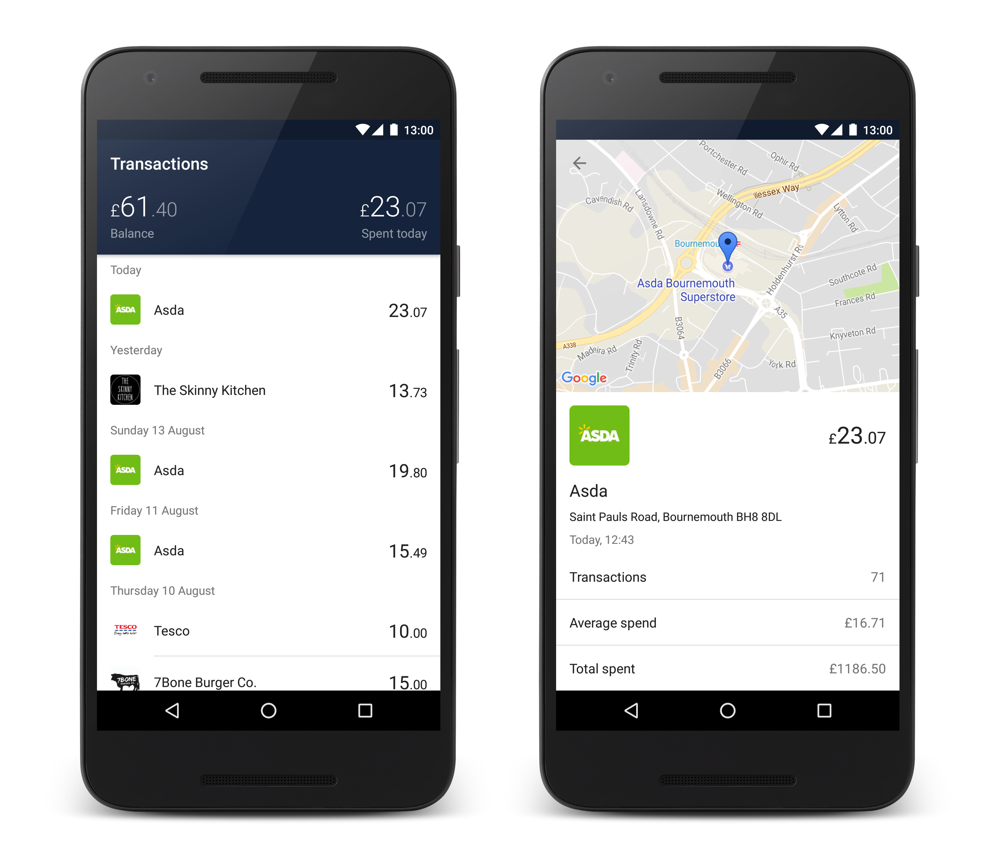

# Moniker

Moniker is an unofficial Android client for [Monzo][monzo].



## Credentials
In order to build this project, you will need to create:

* A [non-confidential Monzo client][monzo-client]. The scheme of your redirect URL should probably be `https`, as most Android email clients do not properly support links with custom URL schemes.
* A [Google Maps API key][maps-key]. If this key is restricted by package name, `glass.phil.monzo` and `glass.phil.monzo.debug` must be whitelisted.

Then, create a `gradle.properties` file in the root directory of the project that defines the following properties:

```properties
clientId=oauthclient_0000745hm4CUro3nk3Sk8Tx
clientSecret=6DdFZWc0ba34T93QVWkLYin9ubIncfrqBi4BIbAqdK0jU57EqyfHrjgNOiB1AAHkl0YXw6iYqE5k4W61XELHF
redirectScheme=https
redirectHost=your.redirect.host
mapsApiKey=yPjxzf9GrLVoeOxo4ena9JwnNmfisz9hA-jT3iCi
```

## Tests
This project includes an extensive suite of unit, integration and functional tests split across 3 directories:

* `test` - Unit/integration tests that run on a desktop JVM.
* `instrumentedTest` - Unit/integration tests that run on an Android device or emulator.
* `functionalTest` - Functional tests that run on an Android device or emulator. These exercise as much of the real production code as possible, and expect a complete Dagger object graph to be available.

Running Robolectric tests in Android Studio may require [some additional setup][robolectric].

[monzo]: https://monzo.com/
[monzo-client]: https://developers.monzo.com/ 
[maps-key]: https://developers.google.com/maps/documentation/android-api/signup
[robolectric]: http://robolectric.org/getting-started/
